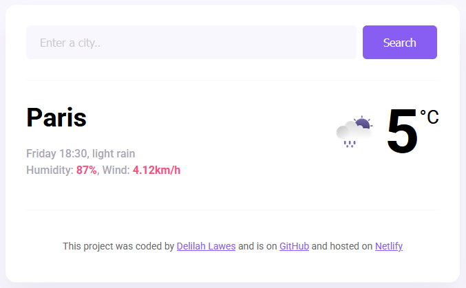

# Weather App

[](https://app.netlify.com/sites/my-weather-app-lilah/deploys)

## Description

A weather application developed as part of SheCodes Plus Week 7 coursework. This project focuses on delivering current weather information through an interactive interface.

## Preview

<p align="center">
  
</p>

## Core Features

- City search functionality
- Current temperature display
- Real-time weather conditions with icons
- Wind speed information
- Humidity percentage
- Weather descriptions

## Technologies Used

- HTML5
- CSS3
- Vanilla JavaScript
- Axios for API requests
- SheCodes Weather API
- Vite as build tool

## Setup

To run this project locally:

```bash
# Clone the repository
git clone https://github.com/delilah-lawes/my-weather-app

# Install dependencies
npm install

# Create a .env file and add your API key
VITE_API_KEY=your_api_key_here

# Start the development server
npm run dev
```

## Deployment

This project is deployed on Netlify at: [my-weather-app-lilah.netlify.app](https://my-weather-app-lilah.netlify.app)
